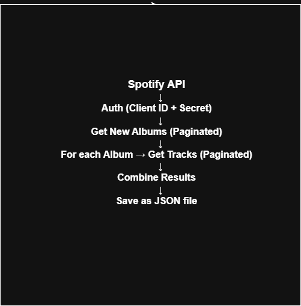
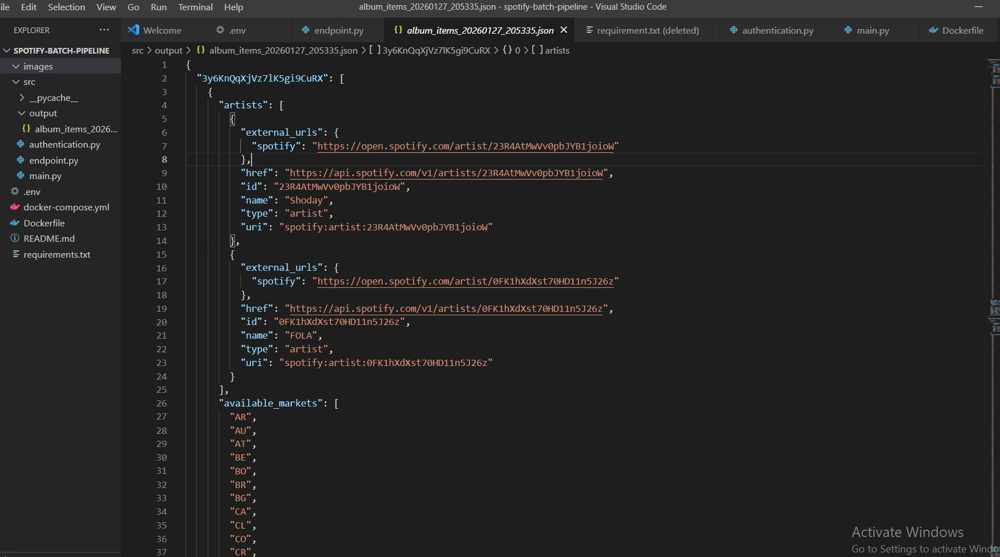

# 🎵 Spotify Batch Data Pipeline

This project is a Python-based batch data pipeline that extracts data from the Spotify Web API, processes it using pagination, and stores the results as JSON files. The pipeline is containerized with Docker for reproducibility and portability.

It demonstrates real-world data engineering concepts such as:
- API authentication
- Pagination handling
- Secure credential management
- Batch processing
- Dockerized execution
- Structured project layout

---

## 🏗 Architecture



**Flow:**

Spotify API → Authentication → Paginated API Calls → Data Processing → JSON Output Storage

---

## 📁 Project Structure

```text
spotify-batch-pipeline/
│
├── docker-compose.yml
├── Dockerfile
├── requirements.txt
├── .env                # NOT committed to GitHub
├── .env.example        # Template for secrets
│
├── src/
│   ├── authentication.py
│   ├── endpoint.py
│   ├── main.py
│   └── output/
│
├── images/
│   └── Output_screenshot.PNG
│
└── README.md

🔐 Environment Variables
This project uses Spotify Client Credentials authentication.

Create a .env file in the root directory:

CLIENT_ID=your_spotify_client_id
CLIENT_SECRET=your_spotify_client_secret
⚠️ Not to be pushed .env to GitHub. It is ignored using .gitignore.


🐳 Running with Docker
Build and run the pipeline:

docker compose up --build
This will:

Build the container

Authenticate with Spotify

Fetch new releases

Fetch album tracks using pagination

Save results into src/output/


📤 Output
The pipeline creates timestamped JSON files:

src/output/album_items_YYYYMMDD_HHMMSS.json
Each file contains:

Album metadata

Track listings per album

Screenshot of Output:




⚙ Key Features
Spotify Client Credentials Authentication

Automatic token refresh

Pagination handling

Rate limiting protection

Secure secrets handling

Dockerized execution

Timestamped batch output

🧠 Future Improvements
Load data into PostgreSQL

Add Airflow orchestration

Add logging and monitoring

Transform data into analytics tables

Schedule pipeline runs

Add data validation

👨‍💻 Author
Daniel Okom
Aspiring Data Engineer

⭐ Acknowledgements

Spotify Web API

Docker

Python Requests